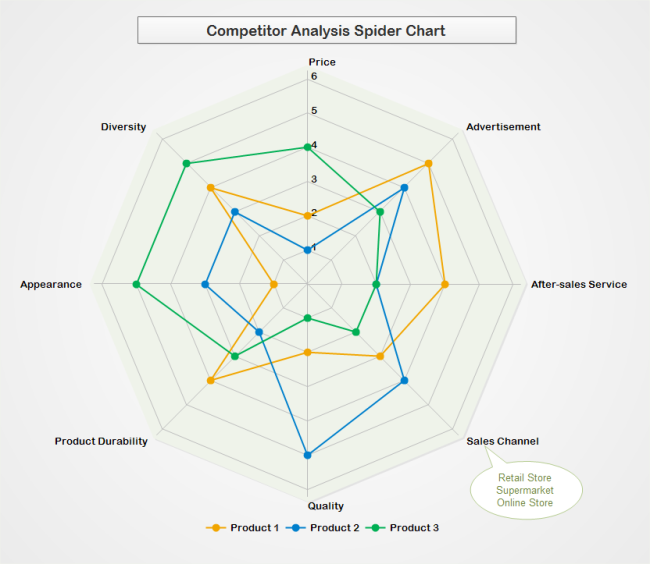
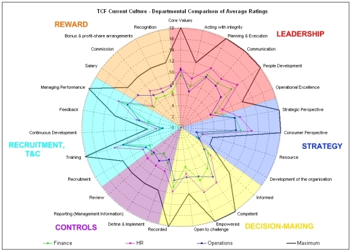

# Data Visualisation : Radar Chart

## Introduction
Le Radar Chart appelé en français : diagramme de Kiviat, diagramme en radar, diagramme en étoile ou encore en diagramme toile d'araignée permet de représenter sur un plan des attributs quantitatifs sur une échelle commune.

<table border="0">
  <tr>
    <td>
      
    </td>
  </tr>
  <tr>
    <td align="center" bgcolor="EFEFEF">
      Exemple d'un diagramme Radar : évaluation d'une méthodologie Kaizen [1]
    </td>
  </tr>
</table>

## Description

Le Radar Chart comporte N axes ayant la même origine et la même échelle. N représente le nombre de variable (attributs) associés à l'observation que l'on veut représenter. Il est commun de tracer des cercles d'équipotentiel reliant les mêmes niveaux de varibles.
Pour une observation, on relie par des segment les axes successifs en partant de la valeur de la première variable et en terminant sur la valeur de la deuxième. On obtient ainsi un polygone fermé où il est visuellement aisé d'observer les variables à bas niveau et à aux niveau.
Il est possible de superposer deux observation afin de les comparer et de sélectionner la meilleure en fonction des attributs à privilégier.

<table border="0">
  <tr>
    <td>
      
    </td>
  </tr>
  <tr>
    <td align="center" bgcolor="EFEFEF">
      Description d'un Radar Chart [2]
    </td>
  </tr>
</table>

## Utilisation & Exemples connus

Les Radar Chart sont principalement utilisés en marketing afin de comparer plusieurs produits sur un même segment de population.

<table border="0">
  <tr>
    <td>
      
    </td>
  </tr>
  <tr>
    <td align="center" bgcolor="EFEFEF">
      Usage d'un Radar Chart en Marketing [3]
    </td>
  </tr>
</table>

On retrouve aussi les Radar Chart dans le domaine des ressources humaines afin de représenter visuellement les points forts et points faibles d'un candidat.

<table border="0">
  <tr>
    <td>
      
    </td>
  </tr>
  <tr>
    <td align="center" bgcolor="EFEFEF">
      Usge d'un Radar Chart dans les ressources humaines [4]
    </td>
  </tr>
</table>

Un example très connus d'application de cette visualisation est observable dans le jeu vidéo Fifa18 où chaque joueur se voit évaluer son niveau sur plusieurs critères.

<table border="0">
  <tr>
    <td>
      
    </td>
  </tr>
  <tr>
    <td align="center" bgcolor="EFEFEF">
      Usage d'un Radar Chart dans le jeu Fifa18 [5]
    </td>
  </tr>
</table>

## Critiques

### Les côtes positifs

* Visualisation globale aisé et naturelle : utilisation simultanée de forme, d'angle et d'air
* Possibilité de comparer les valeurs des variables (cercle équipotentiel)
* Comparaison de plusieurs individus

### Les côtés négatifs

* Nombre limité d'individus pouvant être comparé simultanément
* Nécessite une échelle commune (ou utilisation d'échelle absolue, ie on ne peut pas comparer des °C et des €)
* Le nombre de variable utilisable est borné : minoré par 3 (par construction géométrique) et majoré par 10 (par souci de lisibilité).

## Sources

* [1] Kaizen Radar Chart Figure : http://asqservicequality.org/wp-content/uploads/2016/05/Radar_Chart_Figure.png
* [2] Radar Chart Exemple : https://datavizcatalogue.com/methods/radar_chart.html
* [3] Marketing Data Viza : https://www.edrawsoft.com/competition-analysis-charts.php
* [4] Human ressources Radar Chart : http://www.mclarensolutions.com/wp-content/uploads/2011/01/tcfdepartmentalaverage.jpg
* [5] Utilisation dans Fifa18 : https://indicadoresportivo.com/wp-content/uploads/2017/09/fifa18_radarchart.png
